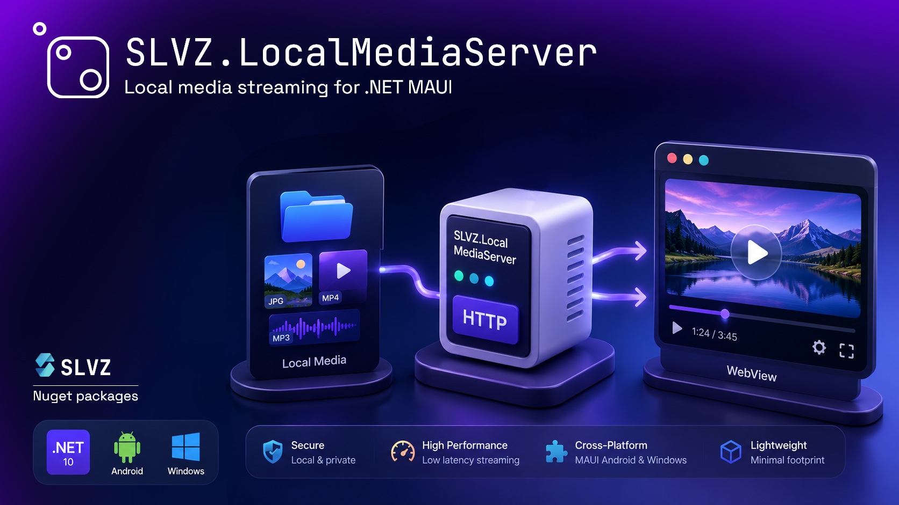

# SLVZ.LocalMediaServer

A minimal, dependency-free local HTTP server for .NET MAUI apps that lets a `WebView`
stream files it normally couldn't load directly — Android `content://` Uris and
absolute paths, and Windows file paths — over `http://127.0.0.1`, with HTTP Range
support for video/audio seeking.

No cloud, no external server: everything runs loopback-only, on-device.

## Why

WebViews can't load `content://` Uris directly, and loading a whole file into memory
before showing it doesn't scale to large images or videos. This package opens a tiny
TCP/HTTP server on a free local port and streams the requested file straight from its
platform-native source (`ContentResolver` or direct file access on Android,
`File.OpenRead` on Windows) in chunks, with proper `Range` header support so
`<video>`/`<audio>` seeking works.

## Supported platforms

- Android
- Windows

## Installation

```
dotnet add package SLVZ.LocalMediaServer
```

## ⚠️ Required setup

### Android

Add these to your `Platforms/Android/AndroidManifest.xml`, on/inside the
`<application>` tag:

```xml
<application android:usesCleartextTraffic="true" ...>
    <uses-library android:name="org.apache.http.legacy" android:required="false" />
    ...
</application>
```

- **`android:usesCleartextTraffic="true"`** — the server is plain `http://127.0.0.1`,
  not `https://`. Without this, Android's default network security config blocks
  cleartext traffic and every request to the local server will silently fail.
- **`<uses-library android:name="org.apache.http.legacy" .../>`** — required for the
  legacy HTTP stack this package's request parsing relies on. Mark it
  `android:required="false"` so it doesn't block installation on devices/API levels
  where it isn't present as a separate library.

**Both of these are mandatory — skip either one and the server will not work on
Android.**

### Windows

If you're publishing/running your MAUI Windows app as a **packaged app (MSIX)**, you
may hit Windows' loopback network isolation, which blocks packaged apps from reaching
`127.0.0.1` by default. If the server doesn't respond only on Windows and only in a
packaged build, exempt your app with (run as Administrator):

```
CheckNetIsolation.exe LoopbackExempt -is -n=<PackageFamilyName>
```

Get `<PackageFamilyName>` from `Package.appxmanifest`, or in PowerShell:

```powershell
Get-AppxPackage *YourAppName*
```

This isn't needed for unpackaged (plain `.exe`) builds.

## Usage

### 1. Start the server

Start it once, early in your app's lifecycle (e.g. `MauiProgram.cs` or your main page's
constructor):

```csharp
MediaServer.Start();
```

### 2. Build a URL for a file

Use `MediaServer.Combine(...)` — it takes the source identifier (a `content://` Uri
string, or an absolute file path on either platform), URL-encodes it, and appends it
to `MediaServer.Url` for you:

```csharp
// Android — content:// Uri or an absolute path both work
string url = MediaServer.Combine(androidUri.ToString());

// Windows — absolute file path
string url = MediaServer.Combine(absolutePath);
```

Use the resulting `url` as the `src` of an ``, `<video>`, or `<audio>` tag inside
your WebView content. You don't need to call `Uri.EscapeDataString` yourself —
`Combine` handles encoding internally.

### 3. Check server status

```csharp
if (MediaServer.IsRunning) { /* ... */ }
```

`IsRunning` isn't just a flag you set — it reflects real state. It flips to `false`
automatically if the server stops for **any** reason, including an unexpected failure in
the listener, not just an explicit `Stop()` call.

To react live instead of polling:

```csharp
MediaServer.StatusChanged += isRunning =>
{
    // update a connectivity badge, retry logic, etc.
};
```

### 4. Stop the server

```csharp
MediaServer.Stop();
```

## Features

- **Chunked streaming** — files are never fully loaded into memory; served via a
  pooled buffer (`ArrayPool<byte>`), buffer size adapts to core count.
- **HTTP Range support** — `bytes=start-end`, open-ended (`bytes=1000-`), and suffix
  (`bytes=-500`) forms are all handled, enabling video/audio seeking in a WebView.
- **Android: both `content://` Uris and absolute paths** — files obtained via
  SAF/MediaStore go through `ContentResolver`; plain filesystem paths are opened
  directly, no wrapping needed.
- **No stale caching** — filenames can be reused with new content (e.g. an edited
  photo); the server always tells the client to re-fetch rather than relying on a
  cache key.
- **Graceful 404s** — a missing file, revoked permission, or bad request path returns
  a proper `404`, instead of throwing.
- **Loopback-only** — binds to `127.0.0.1` on a free ephemeral port; not reachable from
  outside the device.

## How URL parsing works

A request built via `MediaServer.Combine("content://media/external/images/media/123")`
produces:

```
http://127.0.0.1:5000/slvz/content%3A%2F%2Fmedia%2Fexternal%2Fimages%2Fmedia%2F123
```

This arrives at the server as just the path (the `http://host:port` part is stripped by
the HTTP client before the request line is sent):

```
GET /slvz/content%3A%2F%2Fmedia%2Fexternal%2Fimages%2Fmedia%2F123 HTTP/1.1
```

The server strips the fixed `slvz/` prefix and URL-decodes the rest to recover the
original source identifier (`content://media/external/images/media/123`), which is then
handed to the platform-specific file reader.

## Notes

- `ContentTypeHelper.GetContentType(fileName)` (referenced internally) should map file
  extensions to MIME types — bring your own implementation or the package's bundled one.
- The server is a static class; only one instance runs per app process.


👨‍💻 **Author:** [SLVZ](https://slvz.dev)